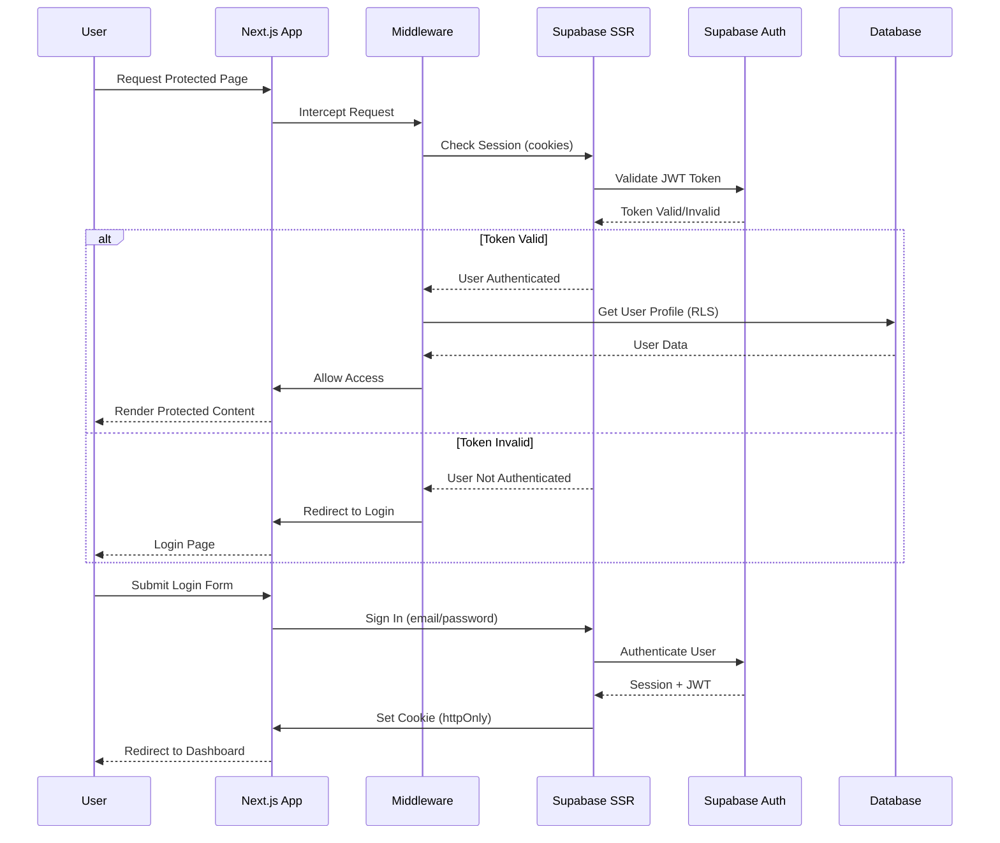
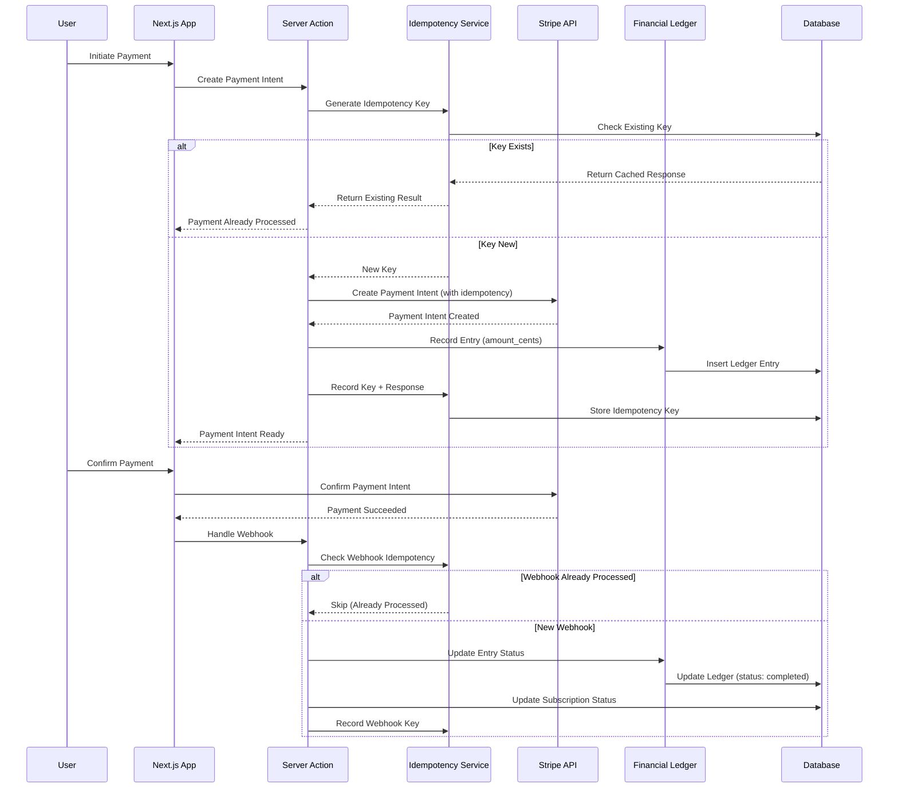
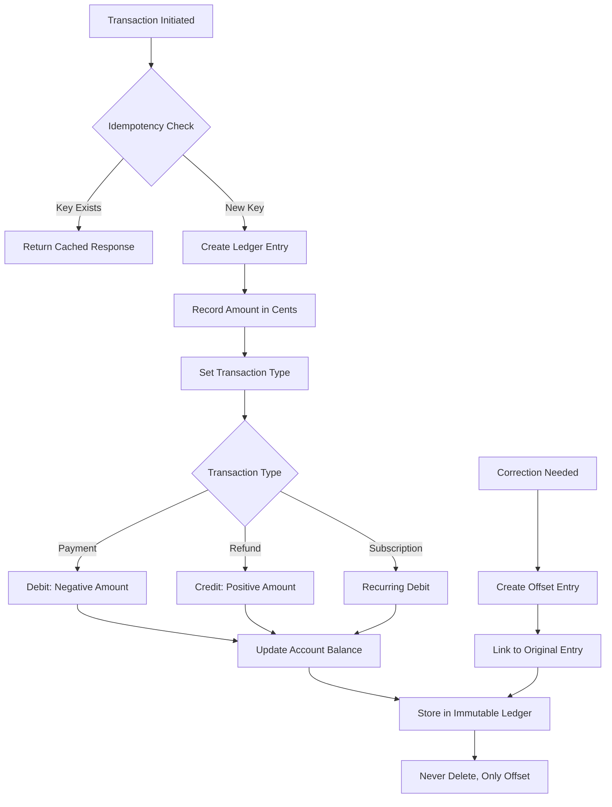
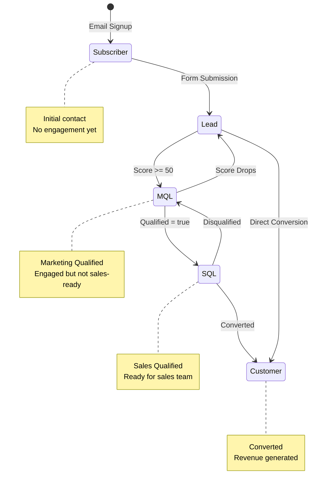
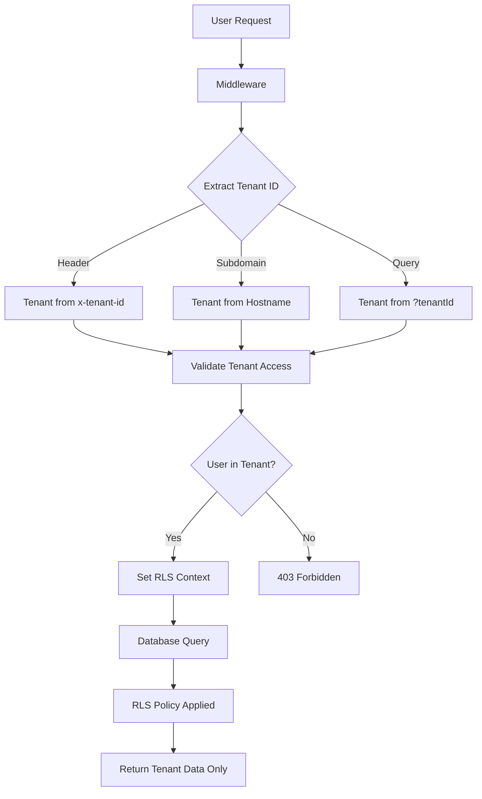

# Architecture Diagrams

## Authentication Flow

```mermaid
sequenceDiagram
    participant User
    participant Next.js App
    participant Middleware
    participant Supabase SSR
    participant Supabase Auth
    participant Database

    User->>Next.js App: Request Protected Page
    Next.js App->>Middleware: Intercept Request
    Middleware->>Supabase SSR: Check Session (cookies)
    Supabase SSR->>Supabase Auth: Validate JWT Token
    Supabase Auth-->>Supabase SSR: Token Valid/Invalid
    alt Token Valid
        Supabase SSR-->>Middleware: User Authenticated
        Middleware->>Database: Get User Profile (RLS)
        Database-->>Middleware: User Data
        Middleware->>Next.js App: Allow Access
        Next.js App-->>User: Render Protected Content
    else Token Invalid
        Supabase SSR-->>Middleware: User Not Authenticated
        Middleware->>Next.js App: Redirect to Login
        Next.js App-->>User: Login Page
    end

    User->>Next.js App: Submit Login Form
    Next.js App->>Supabase SSR: Sign In (email/password)
    Supabase SSR->>Supabase Auth: Authenticate User
    Supabase Auth-->>Supabase SSR: Session + JWT
    Supabase SSR->>Next.js App: Set Cookie (httpOnly)
    Next.js App-->>User: Redirect to Dashboard
```

## Payment Flow (Stripe Integration)

```mermaid
sequenceDiagram
    participant User
    participant Next.js App
    participant Server Action
    participant Idempotency Service
    participant Stripe API
    participant Financial Ledger
    participant Database

    User->>Next.js App: Initiate Payment
    Next.js App->>Server Action: Create Payment Intent
    Server Action->>Idempotency Service: Generate Idempotency Key
    Idempotency Service->>Database: Check Existing Key
    alt Key Exists
        Database-->>Idempotency Service: Return Cached Response
        Idempotency Service-->>Server Action: Return Existing Result
        Server Action-->>Next.js App: Payment Already Processed
    else Key New
        Idempotency Service-->>Server Action: New Key
        Server Action->>Stripe API: Create Payment Intent (with idempotency)
        Stripe API-->>Server Action: Payment Intent Created
        Server Action->>Financial Ledger: Record Entry (amount_cents)
        Financial Ledger->>Database: Insert Ledger Entry
        Server Action->>Idempotency Service: Record Key + Response
        Idempotency Service->>Database: Store Idempotency Key
        Server Action-->>Next.js App: Payment Intent Ready
    end

    User->>Next.js App: Confirm Payment
    Next.js App->>Stripe API: Confirm Payment Intent
    Stripe API-->>Next.js App: Payment Succeeded
    Next.js App->>Server Action: Handle Webhook
    Server Action->>Idempotency Service: Check Webhook Idempotency
    alt Webhook Already Processed
        Idempotency Service-->>Server Action: Skip (Already Processed)
    else New Webhook
        Server Action->>Financial Ledger: Update Entry Status
        Financial Ledger->>Database: Update Ledger (status: completed)
        Server Action->>Database: Update Subscription Status
        Server Action->>Idempotency Service: Record Webhook Key
    end
```

## Financial Ledger (Credit/Debit Model)

```mermaid
graph TD
    A[Transaction Initiated] --> B{Idempotency Check}
    B -->|Key Exists| C[Return Cached Response]
    B -->|New Key| D[Create Ledger Entry]
    D --> E[Record Amount in Cents]
    E --> F[Set Transaction Type]
    F --> G{Transaction Type}
    G -->|Payment| H[Debit: Negative Amount]
    G -->|Refund| I[Credit: Positive Amount]
    G -->|Subscription| J[Recurring Debit]
    H --> K[Update Account Balance]
    I --> K
    J --> K
    K --> L[Store in Immutable Ledger]
    L --> M[Never Delete, Only Offset]
    
    N[Correction Needed] --> O[Create Offset Entry]
    O --> P[Link to Original Entry]
    P --> L
```

## Lead Lifecycle (CRO Mode)

```mermaid
stateDiagram-v2
    [*] --> Subscriber: Email Signup
    Subscriber --> Lead: Form Submission
    Lead --> MQL: Score >= 50
    MQL --> SQL: Qualified = true
    SQL --> Customer: Converted
    Lead --> Customer: Direct Conversion
    MQL --> Lead: Score Drops
    SQL --> MQL: Disqualified
    
    note right of Subscriber
        Initial contact
        No engagement yet
    end note
    
    note right of MQL
        Marketing Qualified
        Engaged but not sales-ready
    end note
    
    note right of SQL
        Sales Qualified
        Ready for sales team
    end note
    
    note right of Customer
        Converted
        Revenue generated
    end note
```

## Multi-Tenant Data Isolation

```mermaid
graph TB
    A[User Request] --> B[Middleware]
    B --> C{Extract Tenant ID}
    C -->|Header| D[Tenant from x-tenant-id]
    C -->|Subdomain| E[Tenant from Hostname]
    C -->|Query| F[Tenant from ?tenantId]
    D --> G[Validate Tenant Access]
    E --> G
    F --> G
    G --> H{User in Tenant?}
    H -->|Yes| I[Set RLS Context]
    H -->|No| J[403 Forbidden]
    I --> K[Database Query]
    K --> L[RLS Policy Applied]
    L --> M[Return Tenant Data Only]
```
